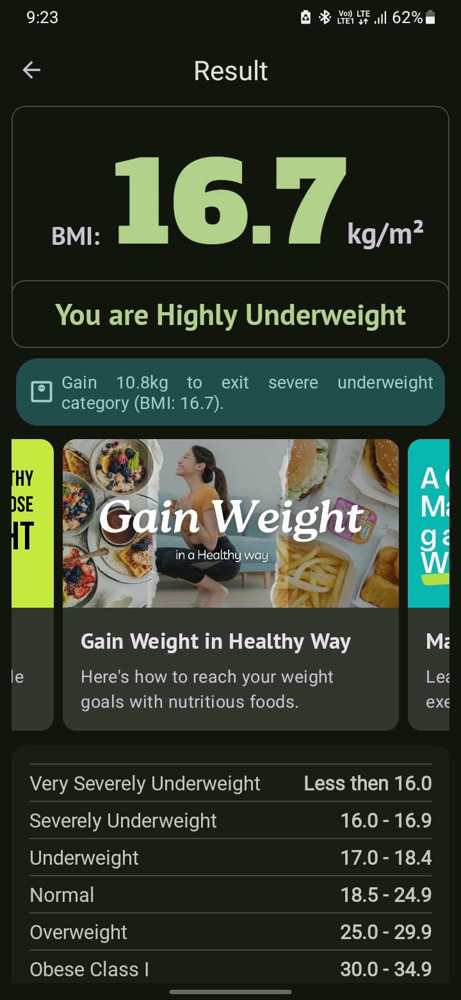

# BMI Calculator

## Description

The **BMI Calculator** is an Android application designed to help users calculate their Body Mass Index (BMI) based on their weight and height. The app provides instant results and categorizes BMI into standard categories (e.g., underweight, normal weight, overweight, obese). This tool is ideal for anyone looking to monitor or understand their BMI.

The app is available for download on the Google Play Store:  
[](https://play.google.com/store/apps/details?id=com.ramphal.healthchecker)

## Features

- Simple and intuitive interface for BMI calculation.
- Input weight and height in metric units (kilograms and meters).
- Displays BMI value along with its corresponding category.
- Lightweight and fast Android application.

## Screenshots

Below are some screenshots of the application:

<div style="display: flex; flex-wrap: wrap; justify-content: center;">
  
  
  
  
</div>

## Technologies Used

- **Language:** Java
- **IDE:** Android Studio
- **Platform:** Android

## Prerequisites

To set up and run the project locally, ensure you have the following:

- Android Studio (latest version recommended)
- Java Development Kit (JDK 8 or newer)
- A physical or virtual Android device for testing

## Installation

Follow these steps to set up the project locally:

1. Clone the repository:
   ```bash
   git clone https://github.com/varuns18/BMI-Calculator.git
   ```
2. Open **Android Studio**.
3. Select **"Open an Existing Project"** and navigate to the cloned repository folder.
4. Let Android Studio sync the project and resolve dependencies.
5. Build the project by selecting **Build > Make Project** in the top menu.
6. Run the app by selecting **Run > Run 'app'** or pressing `Shift + F10`.

## Usage

1. Launch the BMI Calculator app on your Android device or emulator.
2. Enter your weight in kilograms and height in meters.
3. Tap the "Calculate" button to compute your BMI.
4. View your BMI value and its corresponding category.

## Contributing

Contributions are welcome! To contribute:

1. Fork this repository.
2. Create a new branch for your feature or bug fix:
   ```bash
   git checkout -b feature-name
   ```
3. Make your changes and commit them:
   ```bash
   git commit -m "Add feature-name"
   ```
4. Push your branch:
   ```bash
   git push origin feature-name
   ```
5. Open a pull request describing your changes.

## License

This project is licensed under the MIT License. See the [LICENSE](LICENSE) file for details.

## Contact

For questions, suggestions, or feedback, reach out to the repository owner:

- **GitHub Profile:** [varuns18](https://github.com/varuns18)

---

**Note:** Make sure to replace `assets/home_screen.png`, `assets/input_screen.png`, and `assets/result_screen.png` with the actual paths to your images in the repository. You can also adjust the section titles or descriptions as needed.
